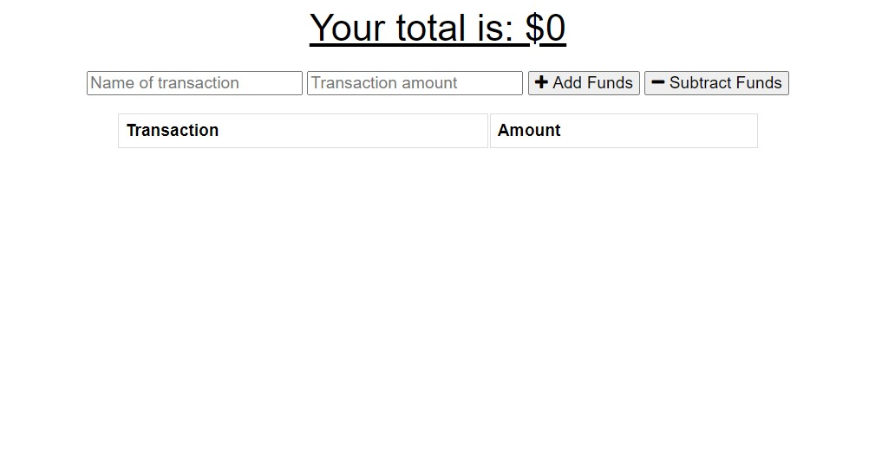
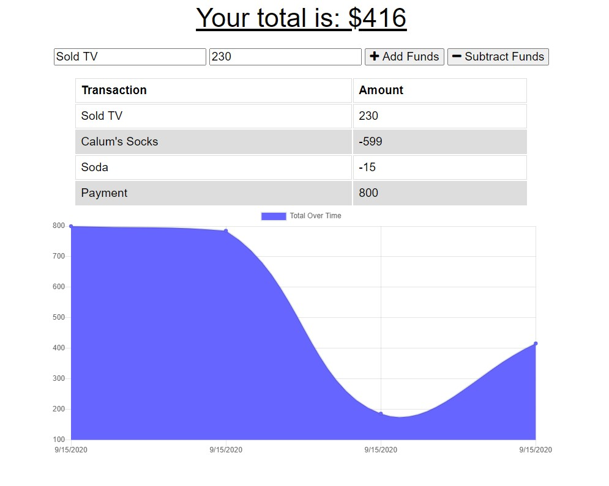

# budget-tracker

Homework18 - Makoto Asahi

Deployed Link: 
https://secret-dusk-61641.herokuapp.com/

# Description

Using the given code, add functionality to allow users offline access and functionality to the site.
```

Offline functionality must allow users to:

- Enter deposits offline

- Enter expenses offline

The app must also do the following once internet connection is restored:

- Offline entries will be added to the tracker.

```

The given code has been preserved as much as needed.

Changes to the code include:

- Port config in `server.js`

- Added `manifest.json` file 

- Added `db.js` file

- Added `service-worker.js` file

- Path added in `index.html` for the newly added files





